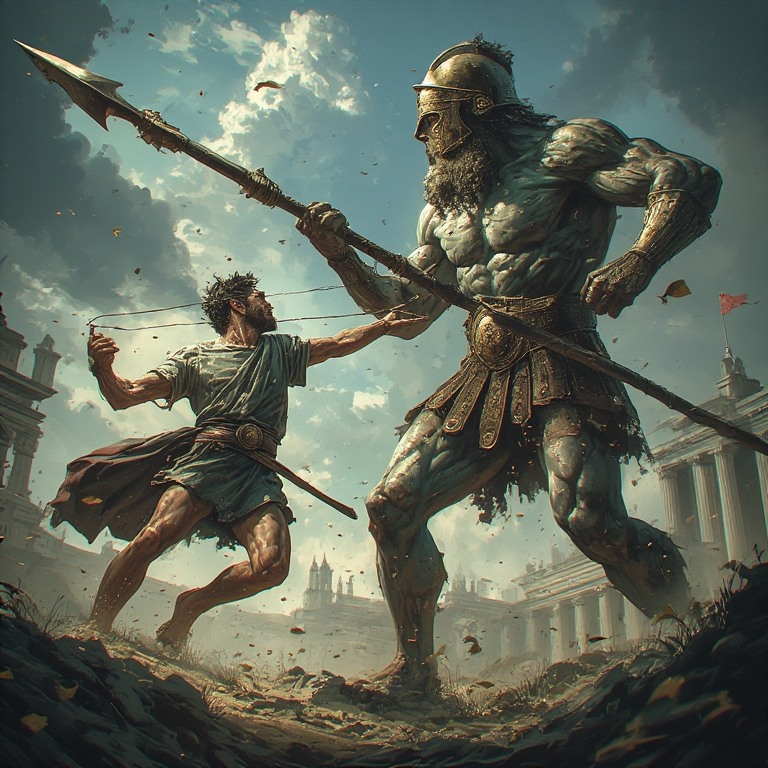

# Introduction

The market is not a fair fight. A handful of players — banks, hedge funds, market makers — move enough size that they can't hide. When they want to buy a billion dollars' worth of EUR/USD, they can't just hit the market; they'd slip the price against themselves. So they accumulate quietly, push, trap, and fill. Every one of those actions leaves a footprint in the candles.

You and I don't have their balance sheets. We can't move the market. But we can *read* it — and the same size that makes them powerful also makes them visible. If you know what to look for, the chart becomes a quiet record of where they built their positions, where they're defending them, and where they're about to pivot.

Price tells a story of what the giants are doing. One candle at a time, it reveals where they tried, where they failed, where they came back and took what they wanted. Your job is not to predict the future. It's to read the story carefully enough — to spot the clues and footprints — to guess what comes next.

Every trade is still a bet; no read is a guarantee. The point of this book isn't to teach you how to be right every time — it's to teach you to bet with an **edge**. A few extra clues on your side, repeated across enough trades, is the difference between gambling and trading.

