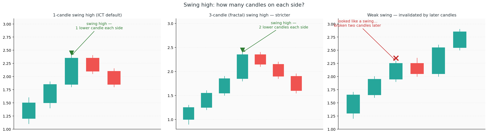
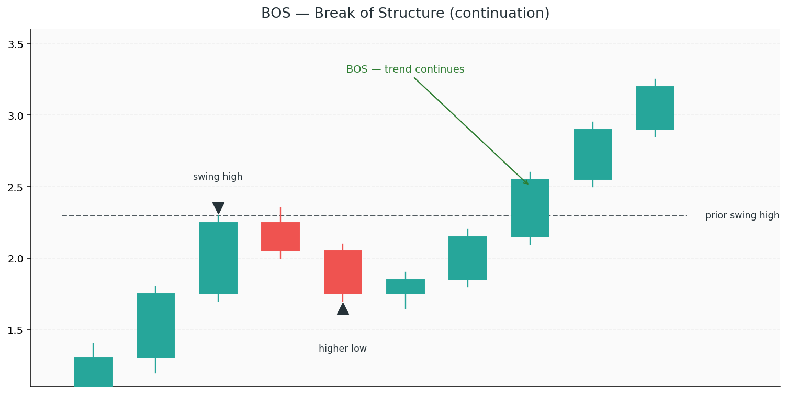
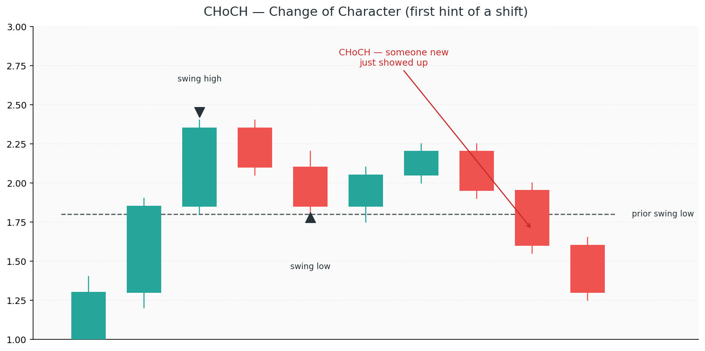
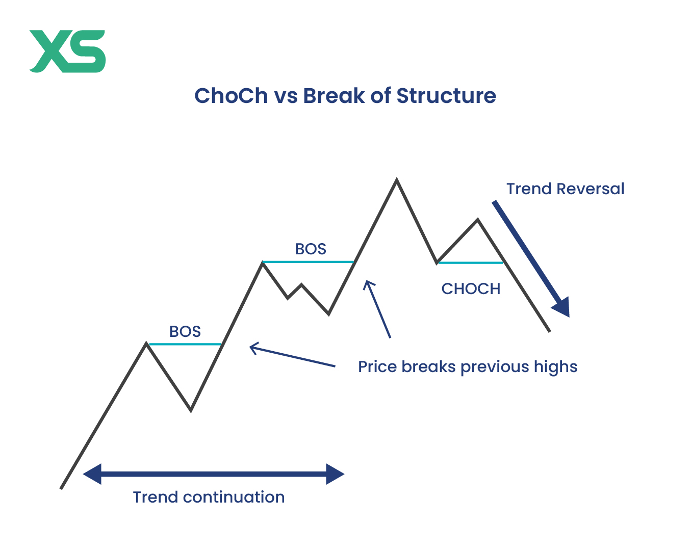
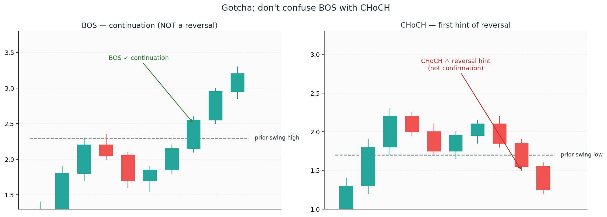
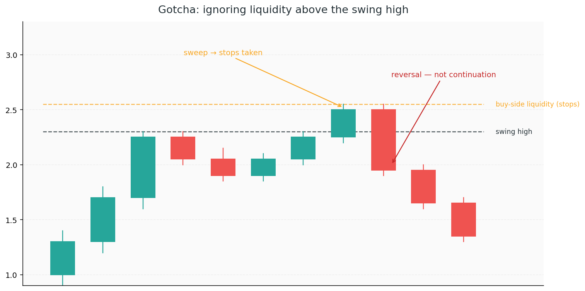
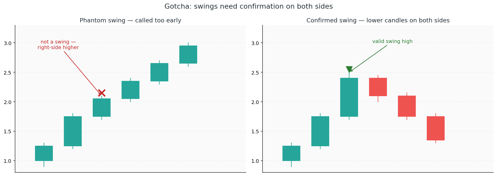
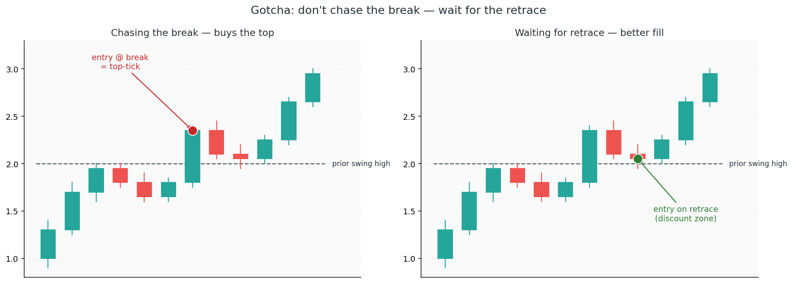

# 1. Market Structure

The story is told by **swing highs and swing lows** — the punctuation of the chart. They are the moments price pauses, the moments the giants showed their hand.

The story is also **fractal**: the same plot plays out on every timeframe. A monthly chart tells it across years; a 5-minute chart tells it across a session. Different stakes, same cast.

## Concepts

### Swing high / swing low

A candle with candles on both sides being lower (for a swing high), or higher (for a swing low).

Swings are where price slows down — where something actually happened. A swing high is the point where buying pressure couldn't push further; large sellers stepped in and stopped the rally. A swing low is the mirror: large buyers absorbed the selling. These aren't random turns; they're the edges of a footprint.

#### How many candles on each side?

There's no single canonical rule — it's a judgement call. The three common conventions are:

| Convention | Candles each side | Character |
|---|---|---|
| **1-candle swing** (ICT default) | 1 | Fast, catches every wobble — noisy on LTF |
| **3-candle (fractal) swing** | 2 | Stricter, filters out minor swings — good for M5/M15 |
| **5-candle swing** | 3+ | Only major structural swings — used for HTF narrative |

ICT itself most commonly uses the **1-candle** definition, especially on higher timeframes where each candle already represents a meaningful chunk of price action. On lower timeframes, many traders step up to 2 or 3 candles each side to cut the noise.

#### You can only confirm a swing in hindsight

A swing is never a swing while the candle is forming. You need the right-side candles to actually print before the label is earned. In real time, every "swing" is **provisional** — the next candle might push further and erase it.

So if you see a candle with one lower candle on each side, but the candle *two bars later* goes higher, that early candle was a **weak swing**. Technically it met the 1-candle definition, but the trend kept going. In practice, you'd discard it and use the next valid swing as your reference.

Structure reading is a craft, not a formula. The definition tells you where to look; the context tells you what actually matters.

### When is a trend actually a trend?

A single higher high is **not** a bullish trend. It's one data point — interesting, but not yet a bet worth placing.

The story builds in stages, and each stage gives you a slightly better edge:

1. **Higher high (HH)** — buyers pushed past the previous peak. Something happened, but a single spike could also be a **liquidity grab** — a quick sweep of the stops above the old high with no follow-through. One clue, low confidence.
2. **Higher low (HL)** — on the pullback, buyers stepped in *above* the prior low, refusing to let price trade back to the old discount. Now the story has a *pair* of clues: the push *and* the defended pullback. This establishes **bullish bias** — a reason to start looking for longs.
3. **Break of Structure (BOS)** — price pushes past the HH you just identified, confirming the HL actually held and the buyers still have orders to fill. This is the moment the trend becomes **tradable** — the bias has now proven itself.

So **HH + HL gives you bias**; **HH + HL + BOS gives you continuation confirmation**. Most ICT traders wait for the BOS before taking the trade, because the BOS is the difference between *"I think buyers are in charge"* and *"buyers have proven they're in charge."*

The mirror applies to bearish trends: **LL + LH = bearish bias**, and a BOS below the LL confirms continuation.

| What you see | What the story is telling you | Confidence |
|---|---|---|
| 1× HH only | Could be real — could be a stop hunt. Keep watching. | Low |
| 1× HH + 1× HL | Bullish *bias* forming — worth watching for a long | Medium |
| HH + HL + BOS | Bullish trend *confirmed* — buyers proved the HL held | High |

Higher-confidence setups don't guarantee a winner — every trade is still a bet. But waiting for all three stages stacks the odds in your favour, and over enough trades that edge is how you come out ahead.

### BOS — Break of Structure

When price breaks past a previous swing high (in an uptrend) or swing low (in a downtrend).

The story here: **the current side is still in charge.** Whoever has been pushing has enough conviction — and enough remaining orders — to drive through the last structural level and continue. A BOS is a *continuation* clue, not a reversal clue.

* A BOS is not a reversal
* A BOS does not mean "price has gone too far"
* A BOS confirms the trend; the big money is doubling down

### CHoCH — Change of Character (also MSS — Market Structure Shift)

The first hint that the side in charge may have changed.

* In a *bullish trend* 𝆱, price breaks a *swing low* → bearish CHoCH
* In a *bearish trend* 𝆲, price breaks a *swing high* → bullish CHoCH

A CHoCH is the moment the story shifts: someone new just showed up. The side that was pushing has eased off, or the other side has finally brought enough size to overpower them. But one new footprint doesn't change the story — the old side might still come back.

**A CHoCH is a hint, not confirmation.** You've seen a single clue, not a trail. Confirmation comes when the new direction prints its own HH+HL (or LL+LH) and then delivers a BOS — the new side has now left a full footprint.

### Trend types

* **Bullish** 𝆱 — the big money is accumulating and pushing higher (HH + HL)
* **Bearish** 𝆲 — the big money is distributing and pressing lower (LL + LH)
* **Consolidation** — the big money is *building a position* sideways, waiting for enough orders to gather before the next move

## Common Gotchas

Most misreadings come from listening to the wrong clue, or reading conviction into a hint:

### Treating a BOS as a reversal

A break of structure tells you *the current side is still in charge* — not *they've given up*. Seeing price push past a recent swing high in a bullish trend does **not** mean "it's gone too far, time to short." It means the big buyers still have orders to fill.

The first hint that the side has changed is a **CHoCH**, not a BOS.

### Treating a CHoCH as confirmation

A CHoCH is a single hint — one new footprint. It is not proof. Many traders flip bias the moment they see one, then get steamrolled when the original side returns and resumes its push.

Wait for follow-through: a fresh HH+HL (or LL+LH) and a BOS in the new direction. That's the new side leaving a full trail — and the point where the odds have genuinely shifted in your favour.

### Calling a trend after one swing

One higher high is one clue. A trend needs a pair: higher high *and* higher low — and for the highest-confidence entry, a BOS on top of that. Until you've seen at least the pair, you're placing a bet on a story told in a single sentence.

### Ignoring liquidity

Swing highs and lows are not just structural points — they're **pools of resting orders**. Retail stops sit above every swing high and below every swing low, and the big players know this. They need liquidity to fill their size, and those stops are free liquidity waiting to be collected.

A classic move: run the stops above a swing high, then turn. If you enter at a swing high expecting continuation, you may be handing your order to the very people who are about to reverse the market.

### Wrong-timeframe structure

A swing on the 5-minute chart and a swing on the 4-hour are two different stories. The M5 might be showing a minor detour; the H4 is showing the main plot. A bearish CHoCH on M5 inside a clean H4 bullish trend is usually just a pullback while the real move continues.

Always anchor your read to the higher timeframe's narrative before trusting lower-timeframe clues.

### Mis-identifying swing points

A valid swing needs candles on *both* sides confirming it. Calling a swing too early is reading the meaning before the sentence is finished — you get phantom structure and BOS/CHoCH events that never actually happened.

### Forcing structure in consolidation

In a range, price chops back and forth, leaving messy partial footprints that look like BOS and CHoCH but mean nothing. The big money isn't pushing — it's **building a position**, soaking up orders on both sides, waiting for enough liquidity to commit. The story has gone quiet; there are no clean clues to read yet.

If the chart looks like noise, it probably is — step back to a higher timeframe or wait for the story to resume.

### Ignoring the context of the break

Not all breaks are equal. A break on a strong impulsive candle with displacement is a **statement of intent** — real size went through the market. A break on a tiny doji that barely clips the level is a whisper — and whispers are often **stop hunts** designed to pull retail into a breakout before the real move goes the other way.

Look at *how* price broke, not just *that* it did. The character of the footprint is part of the read.

### Chasing every break

A break tells you *what happened*, not *where to enter*. Entering the moment price breaks a swing high usually means buying right where the big players are **taking profit** — they pushed the market up, swept the stops above, and are now selling into retail breakout buyers. That's exactly what they wanted you to do.

ICT entries come from *retracements* — waiting for price to return to a discount/premium zone after the break, where the big money is likely to step in again. You're not chasing; you're following them back to where they're buying.

