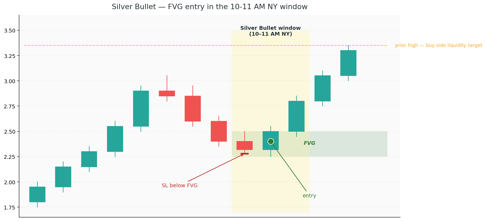

# 10. Strategy — Silver Bullet

The **Silver Bullet** is the flagship ICT strategy — the one ICT himself has talked about most often. It's mechanical, time-bound, and built on stacking the concepts you've already learned. If you only ever trade one ICT setup, this is the one to master first.

The idea is simple: during a specific one-hour window in the trading day, when the giants are most active, take an FVG entry in the direction of the session bias. The narrow window, the strict rules, and the confluence stack are what give it its edge.

## What it is

A **Silver Bullet** trade is:

- A **Fair Value Gap** entry
- Inside an **Optimal Trade Entry** zone (deep discount/premium)
- Taken during a **specific one-hour killzone window**
- In the direction of the **higher-timeframe bias**

The three classic Silver Bullet windows (all New York time):

| Window | Time (NY) | Session |
|---|---|---|
| **London Silver Bullet** | 3:00 AM – 4:00 AM | London open |
| **AM Silver Bullet** | 10:00 AM – 11:00 AM | NY morning |
| **PM Silver Bullet** | 2:00 PM – 3:00 PM | NY afternoon |

The **AM Silver Bullet (10–11 AM NY)** is the most famous and the most commonly traded. Start there.

## Why it works

Three forces compound inside the one-hour window:

1. **It's inside a killzone** — the giants are active, liquidity is deep, setups print cleanly
2. **It often follows the day's manipulation** — by 10 AM, London's judas swing is done and the NY AM distribution is underway. You're trading *with* the real move.
3. **FVG + OTE is a high-quality entry** — you're buying a zone where institutions created an imbalance, at a price that's deep in discount.

Any one of these alone is a decent edge. Stacked, they compound into one of the highest win-rate setups in ICT.

## Step by step

### Step 1 — Establish HTF bias *before* the window opens

Before 10 AM NY, you should already know whether you're looking for longs or shorts. Do this on the H1 and H4:

- What's the **daily structure**? (Chapter 1)
- Is price in **discount or premium** of the current dealing range? (Chapter 5)
- Where's the **next significant liquidity pool** above and below? (Chapter 2)
- Has the morning already delivered the **judas swing**? (Chapter 6)

Come out of this with one sentence: *"I'm looking for longs targeting the buy-side liquidity at 1.0850."* If you can't say that, sit out.

### Step 2 — Wait for the window to open

At 10:00 AM NY sharp, your Silver Bullet clock starts. You have **60 minutes** to find the setup.

Drop to the **M5 or M15** chart. You're looking for:
- Price making a **pullback** (against the HTF bias direction)
- The pullback creating a **Fair Value Gap** in your bias direction
- The FVG sitting in the **OTE zone** (62%–79% of a recent impulse leg)
- Ideally, the pullback has **swept a minor liquidity pool** on the way in

If price is already running hard in your bias direction at 10:00, there's often no setup — the move happened earlier. Don't force it.

### Step 3 — Identify the FVG

On your M5/M15 chart, look for the three-candle imbalance pattern (Chapter 4):

- **For a long:** a bullish FVG — the gap between candle 1's high and candle 3's low after a strong up-candle
- **For a short:** a bearish FVG — the gap between candle 1's low and candle 3's high after a strong down-candle

The FVG should:
- Be freshly created (preferably *within* the window, or in the hour before)
- Sit inside the OTE zone of the prior impulse
- Not be more than a few candles deep (fresh FVGs work best)

### Step 4 — Enter on the tap

As price pulls back into the FVG, you have two entry options:

**Limit entry** (higher probability, lower win rate)
- Place a limit at the **top** of the FVG (for a long) or **bottom** (for a short)
- Risk: price doesn't quite tag it and runs without you
- Reward: you get the best fill if it does tap

**Confirmation entry** (lower probability of fill, higher win rate)
- Wait for price to enter the FVG
- Wait for an **M1 CHoCH** (or a strong rejection candle) in your bias direction
- Enter on the close of the confirmation candle
- Risk: you miss fast reversals
- Reward: you skip the FVGs that fail

Most traders use confirmation for their first 100 trades, then graduate to limits once they trust their HTF read.

### Step 5 — Set the stop

The stop goes **beyond the FVG**, plus a small buffer:

- **For a long:** below the low of the FVG's candle 3 (or below the low that the pullback just made, whichever is lower)
- **For a short:** above the high of the FVG's candle 3 (or the pullback high)

Give it a few pips / points of breathing room. The exact wick of the FVG is where other retail traders place stops — the giants know, and sometimes they'll sweep it.

### Step 6 — Set the target

Targets come from the HTF analysis you did in Step 1:

- **Primary target:** the next unswept liquidity pool in your direction (old swing high for longs, old low for shorts)
- **Minimum target:** 2R (risk-reward of 2:1)
- **Partial management:** take partials at 1R, move stop to break-even, let the rest run to the primary target

If the primary target doesn't give you at least 2R from your entry, **don't take the trade.** The risk-reward is too thin.

### Step 7 — Close the trade or walk away

- **Target hit:** full exit, done for the day
- **Stop hit:** take the loss, done for the day (or wait for the PM window with a fresh setup)
- **Window closed without setup:** no trade. Turn off the chart.

Silver Bullet is a **one-trade-per-window** strategy. After the window closes, don't hunt for "similar" setups in dead time. The whole edge is the window.

## Example walkthrough

**Scenario:** it's 9:30 AM NY on a Tuesday. EUR/USD daily is bullish (clean HH + HL + BOS on the daily). Price opened the session at 1.0820 and drifted down to 1.0795 during the early NY hour.

**Step 1 (pre-window):** HTF bias = long. Target = the overnight high at 1.0840 (unswept buy-side liquidity).

**Step 2 (10:00 AM):** window opens. Price is at 1.0800, pulling back from a small intraday high of 1.0825.

**Step 3 (FVG):** on the M5, you spot a bullish FVG between 1.0802 and 1.0808, formed at 9:45 AM from a strong up-candle that got pulled back into.

**Step 4 (entry):** price taps 1.0808 at 10:12 AM. You wait for confirmation — the next M1 candle closes strongly bullish, forming an M1 CHoCH. You enter long at 1.0810.

**Step 5 (stop):** 1.0792 (below FVG + buffer). Risk = 18 pips.

**Step 6 (target):** 1.0840 (+30 pips). Risk-reward = 1.66R. *Not enough* — you scale back and target 1.0846 (buy-side liquidity just above the overnight high) for 2R.

**Step 7:** by 10:48 AM, price has pushed to 1.0838. You take partials at 1.0828 (1R), move SL to 1.0810 (break-even). Remainder runs to 1.0846 by 11:22 AM — stopped on target. Done for the day.

## Common failures

### Taking the setup without the HTF bias

The Silver Bullet without HTF alignment is a coin flip. The setup itself isn't magic — it's only reliable *with* the trend. If you can't state your bias in one sentence before 10:00 AM, don't trade the window.

### Entering outside the window

10:17 AM is fine. 11:03 AM is not. The window is what creates the edge. Trades taken 20 minutes after the window closes have a different risk profile and are no longer part of this strategy.

### Chasing a runaway move

If price is already a full-bodied impulse away from your intended entry zone by 10:05, the setup is gone. Don't chase. A proper Silver Bullet requires a **pullback into** the FVG during the window — not a breakout.

### Using an FVG from yesterday

A fresh FVG (created in the last few hours) has drastically better reactions than a day-old one. Old FVGs have usually been mitigated or lost their institutional relevance.

### Ignoring the session-level PO3

If the day's manipulation hasn't happened yet at 10 AM (no London sweep, no judas), the 10-11 window is more likely to *be* the manipulation rather than the distribution. Check the morning before committing.

## Realistic expectations

- **Win rate:** a well-executed Silver Bullet prints 50–65% across the long run. Some traders report higher; their results are usually filtered for perfect setups and exclude skipped days.
- **Average R:** 1.5–2.5R on winners (after partials).
- **Frequency:** one setup per day, *when it materialises*. Expect 2–3 valid setups per week, not 5.
- **Instruments:** works best on liquid instruments with clean 10 AM reactions — EUR/USD, GBP/USD, NQ, ES, Gold.

Don't trade a Silver Bullet without first backtesting at least 30 of them on your chosen instrument. Knowing the rules is different from trusting them.
