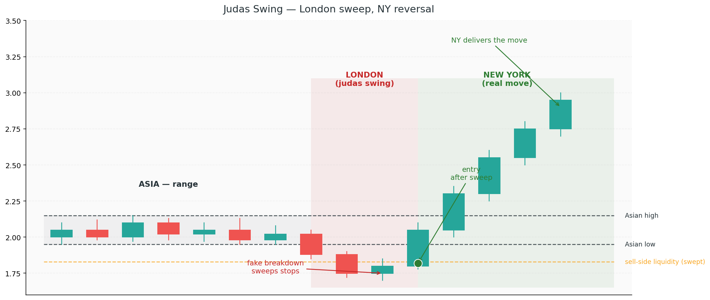

# 11. Strategy — Judas Swing Reversal

If the Silver Bullet is ICT's flagship model, the **Judas Swing Reversal** is its most reliable "read-the-story" trade. It's not as mechanical as Silver Bullet — there's no fixed time window — but it captures one of the most consistent institutional rhythms on the chart: the fake move into the real move.

The name comes from the Biblical Judas. The move "betrays" the day's true direction, traps retail in the wrong way, and then reverses hard in the direction the giants actually wanted to go.

## What it is

A Judas Swing Reversal is:

- A **liquidity sweep** of a known session range (Asian range, overnight high/low, or previous session extremes)
- Followed by **displacement** back inside the range
- Taken as a **reversal trade** in the direction opposite to the sweep
- Typically executed at the **London open (2–5 AM NY)** or **NY open (9:30 AM NY)**

The two cleanest windows:

| Trade | Sweep during | Entry window |
|---|---|---|
| **London Judas** | London open (2–5 AM NY) — sweeps Asian range | 3–7 AM NY |
| **NY Judas** | NY open (9:30 AM NY) — sweeps London range | 9:30–11 AM NY |

## Why it works

The giants need liquidity to position. Every session open delivers a predictable pattern:

1. The previous session created range highs and lows
2. Retail placed stops above the high and below the low
3. The new session opens, and the first institutional move is to **collect one side** before going the other way
4. The sweep is fast, shallow, and rejected — then the real move unfolds in the opposite direction

The Judas Swing is the trade on step 4. You let the giants do the dirty work (the sweep), then follow them back to where they actually want to go.

## Step by step

### Step 1 — Mark the relevant range

**For a London Judas:**
- Asian session = 7:00 PM – 2:00 AM NY (roughly)
- Mark the **Asian high** and **Asian low**
- Note which side has more liquidity sitting beyond it (equal highs/lows are prime targets)

**For a NY Judas:**
- London session = 2:00 AM – 9:30 AM NY
- Mark the **London high** and **London low**
- Or use the entire overnight range (from the prior NY close)

### Step 2 — Determine HTF bias

Same as Silver Bullet — you need to know the direction *before* the sweep.

Ask: "Which side of the range is the *unintended* target?" If the daily is bullish, the sweep of the *low* is the judas (the fake) and the move up is the real one. If the daily is bearish, the sweep of the *high* is the judas.

In other words: **the giants sweep the opposite side of where they're going.**

### Step 3 — Wait for the sweep

When the session opens, watch the range boundaries:

- **Bullish bias:** wait for price to sweep *below* the Asian low (or London low for a NY Judas)
- **Bearish bias:** wait for price to sweep *above* the Asian high (or London high)

The sweep has specific characteristics:

- **Fast** — usually one or two strong candles, not a slow drift
- **Shallow** — doesn't travel far beyond the level
- **Wicks** — the candle body often closes back inside the range, leaving a wick as the sweep
- **No follow-through** — if continuation candles appear after the break, it's not a judas — it's a real breakout. Abort.

### Step 4 — Wait for the reversal signal

After the sweep, you need confirmation that the move is reversing, not continuing:

- **Displacement back inside the range** — a strong candle in the opposite direction
- **LTF CHoCH** — on the M1 or M5, price breaks the most recent swing high (for a bullish reversal) or low (bearish reversal)
- **FVG formation** — the displacement leaves a fresh FVG that you can use as your entry

This usually happens within 15–30 minutes of the sweep. If it takes longer than an hour, the setup is probably dead.

### Step 5 — Enter

Two entry styles:

**Aggressive entry** — on the M1 CHoCH itself, market order at the break
- Better fill, higher variance
- Works when the sweep was obvious and the reversal is sharp

**Patient entry** — wait for the displacement to leave an FVG, enter on the tap back into the FVG
- Worse fill, lower variance
- Gives more confirmation before risking capital

For your first live attempts, use the patient entry. Let the FVG come to you.

### Step 6 — Stop loss

The stop goes **beyond the sweep wick**, plus a small buffer.

- **For a long (after a low sweep):** stop below the low of the sweep wick, plus 5–10 pips
- **For a short (after a high sweep):** stop above the high of the sweep wick, plus 5–10 pips

This is the natural invalidation point — if price goes back below the sweep low after you've entered long, the reversal has failed and you were wrong.

### Step 7 — Target

Judas reversals typically target:

- **Primary:** the opposite side of the range (the side *not* swept). If London swept the Asian low, target the Asian high.
- **Extension:** if the HTF bias is strong, the next major liquidity pool beyond the range

Partials at 1R (break-even SL), then run the rest to primary target. If you get to primary with strong momentum and no displacement against you, consider extending to the HTF target for 3R+.

## Example walkthrough

**Scenario:** Wednesday, London open on GBP/USD. Daily structure is bullish (recent HH, clear HL). Asian range: high 1.2680, low 1.2655.

**Step 1:** Asian high = 1.2680, Asian low = 1.2655. More equal lows below 1.2655 on the intraday chart — sell-side liquidity pool.

**Step 2:** HTF bias = long. The judas will be a sweep of the *low* (sell-side).

**Step 3:** London opens at 2:00 AM NY. By 3:20 AM, price has dropped to 1.2648, wicking below the Asian low and closing back at 1.2658. Sweep confirmed.

**Step 4:** The next M5 candle is a strong bullish candle closing at 1.2672. An FVG forms between 1.2660 and 1.2668. M1 CHoCH prints on the displacement.

**Step 5:** You wait for the FVG tap. Price pulls back to 1.2668 at 3:45 AM — enter long.

**Step 6:** SL at 1.2644 (below the sweep low + 4 pip buffer). Risk = 24 pips.

**Step 7:** Target at 1.2680 (Asian high). R:R = 0.5R — not enough. You scale target to 1.2710 (previous day's unswept high) for 1.75R. Still marginal.

Here you have a choice: skip the trade, or size down and still take it. Many traders would skip — strict 2R minimums. For this example, we take it at 1/2 position size.

Price reaches 1.2710 at 9:55 AM NY. Stopped on target. Full trade realised ~1.75R at half size = effective 0.87R on account.

**Lesson:** R:R matters. Even the best Judas sweep isn't worth taking without adequate reward.

## Common failures

### Treating a real breakout as a judas

The hardest call. If price breaks the range low and *keeps going*, it's not a judas — it's a genuine breakdown. Signs it's real (not a sweep):
- Multiple strong closes below the level
- No immediate wick-and-reverse
- Expanding volatility (range bars getting bigger as it goes)

If any of these show up, abort. The market is telling you the HTF bias is wrong.

### Entering on the sweep instead of the reversal

The sweep candle itself isn't the entry. The entry is *after* displacement confirms the reversal. Entering on the sweep candle risks getting caught in a deeper sweep before the bounce.

### Chasing after the FVG has filled

The FVG left by the displacement is your entry zone. If price has already moved 30 pips past the FVG without tapping it, the setup is gone. Don't chase.

### Ignoring the broader trend

A Judas setup against the daily trend has maybe 40% odds. With the daily trend, 60–70%. Always align the direction of the reversal with the HTF story.

### Trading judas outside session opens

The concept works best at session transitions (Asian → London, London → NY). Mid-session "mini-judas" setups exist but are much less reliable. Stick to the opens until you've mastered the concept.

## Realistic expectations

- **Win rate:** 55–65% with strict HTF alignment and R:R filters
- **Average R:** 1.5–3R on winners (targets are often further than Silver Bullet because the sweep price is near range extremes)
- **Frequency:** 3–5 valid setups per week, depending on instrument
- **Instruments:** FX pairs with clear session ranges (EUR/USD, GBP/USD, USD/JPY) work best. Indices work but are more news-sensitive.

The Judas Swing is one of the most rewarding setups *when* you can resist entering on the sweep itself. Patience for the reversal confirmation is the entire skill.
