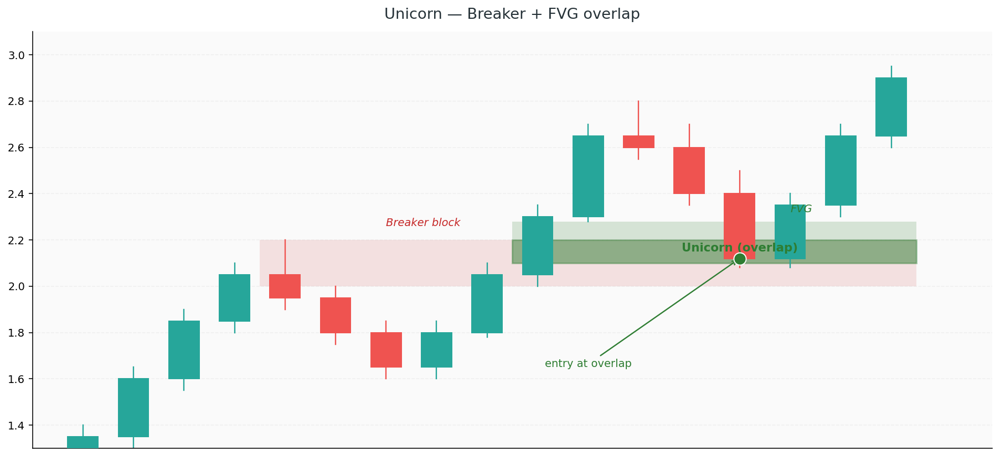

# 12. Strategy — Unicorn Model

The **Unicorn Model** is a specific confluence setup that combines two concepts you already know: a **breaker block** and an overlapping **Fair Value Gap**. When these two zones stack in the same price area — especially at a premium or discount level — you have one of the cleanest, highest-confidence entries in all of ICT.

The name comes from the rarity and reliability of the setup. Unicorns don't appear every day, but when they do, they're worth waiting for.

## What it is

A Unicorn is a trade where:

1. A previous **order block fails** (price blows through it) and becomes a **breaker** (Chapter 3)
2. The displacement move that breaks the OB **leaves an FVG** in its wake (Chapter 4)
3. The FVG **overlaps with the breaker block**
4. Price returns to the overlap zone for entry

The overlap is the "unicorn" — a zone where two institutional footprints agree. Entering there means you're buying (or selling) at a level where both the breaker and the FVG say the giants want to transact.

## Why it works

A single breaker block alone is a decent level. A single FVG alone is a decent level. But a **breaker and an FVG in the same zone** means:

- The zone represents where a previous side *gave up* (the breaker)
- *And* the zone holds unfinished business from the new side (the FVG)
- *And* both happened during a displacement move (institutional conviction)

Three independent confluences point at the same price range. That's not coincidence — that's where the giants are actively transacting.

## Step by step

### Step 1 — Establish HTF bias

As always. The Unicorn model works *with* the trend, not against it. If the HTF is bullish, you're hunting for bullish Unicorns (overlapping bullish breaker + bullish FVG) in discount. If the HTF is bearish, the mirror applies in premium.

### Step 2 — Identify the failed order block (the breaker)

Scan the recent structure for an OB that was blown through:

**Bullish Unicorn (for longs):**
1. Find a recent **bearish OB** — an up-close candle before a downtrend
2. Confirm that price **broke above it** with displacement (this turns it into a bullish breaker)
3. The breaker is now a support zone in a bullish context

**Bearish Unicorn (for shorts):**
1. Find a recent **bullish OB** — a down-close candle before an uptrend
2. Confirm that price **broke below it** with displacement
3. The breaker is now a resistance zone in a bearish context

### Step 3 — Find the FVG inside the breaker

The displacement move that broke the OB almost always leaves an FVG. Look on the same timeframe or one lower:

- The FVG should be part of the **same displacement leg** that created the breaker
- At least part of the FVG should **overlap** with the breaker zone
- The more complete the overlap, the stronger the setup

If the displacement didn't leave an FVG, or the FVG is far from the breaker, it's not a Unicorn — it's just a breaker trade.

### Step 4 — Mark the overlap

Where the breaker zone and the FVG zone intersect, you have the **Unicorn zone** — your entry area.

The overlap is usually a narrow band — 5 to 20 pips on FX, a handful of points on indices. That's ideal. A wide overlap reduces precision and bloats your stop.

### Step 5 — Confirm the zone is in the right half of the range

Add one more filter: the Unicorn zone should be in **discount** (for longs) or **premium** (for shorts) relative to the current dealing range (Chapter 5).

A bullish Unicorn in premium (upper half of the range) is low-quality — you're buying expensive. A bullish Unicorn in discount (lower half) is where the edge lives.

### Step 6 — Wait for price to return

After forming, price will often run further before coming back to mitigate the zone. This can take minutes to hours (or even days on higher timeframes). Your job is patience.

When price returns:

- Ideally, it approaches with a **clean pullback**, not another displacement
- A pullback into the zone means the giants haven't changed their intent — they're just offering another entry
- Displacement *against* your direction into the zone is a warning — the structure might be failing

### Step 7 — Enter on confirmation

When price taps the overlap:

- **Limit entry:** place a limit at the top of the overlap (for a long) or bottom (for a short). High confluence setups can be traded on limits.
- **Confirmation entry:** wait for an M1/M5 CHoCH inside the zone, or a strong rejection candle. Enter on the close.

For Unicorns specifically, **limit entries are often justified** because the confluence is so strong. If you wait for LTF confirmation on every Unicorn, you'll miss the fast ones.

### Step 8 — Stop loss

The stop goes **beyond the breaker block** (not just the FVG):

- **For a long:** below the low of the breaker block's original candle
- **For a short:** above the high of the breaker block's original candle

The breaker's range is the structural level — if price closes beyond it, the breaker has failed again and the setup is dead.

### Step 9 — Target

Unicorns typically run a long way when they work — the confluence means the giants have conviction, and the move rarely stops at the nearest liquidity.

Targets:
- **Primary:** next major unswept liquidity pool in the trade direction
- **Extension:** the opposite extreme of the current dealing range (if HTF bias supports it)

Partials at 1R, break-even SL, let the rest run. Unicorns often produce 3R–5R winners when given time.

## Example walkthrough

**Scenario:** Monday afternoon on ES futures. Daily bias: bullish (recent BOS above the previous week's high).

**Step 1:** Bias = long.

**Step 2:** Earlier in the morning, there was a bullish structure that got interrupted by a sharp drop. The drop started from a clear bearish OB at 4520–4525. Price then reversed hard, breaking back above 4525 with strong displacement. The bearish OB is now a bullish breaker.

**Step 3:** The displacement leg that broke 4525 left an FVG between 4521 and 4528. The FVG overlaps with the breaker zone (4520–4525).

**Step 4:** Unicorn zone = 4521 to 4525 (the overlap).

**Step 5:** Price is at 4545 — the current dealing range is 4510 (yesterday's low) to 4560 (this morning's high). Equilibrium = 4535. The Unicorn zone (4521–4525) is solidly in discount.

**Step 6:** You set a limit order at 4524 and wait.

**Step 7:** Around 1:45 PM NY, price pulls back to 4523 (tagging the zone) and rejects. You're filled.

**Step 8:** SL at 4517 (below breaker + 3 point buffer). Risk = 7 points.

**Step 9:** Target = 4560 (morning high liquidity). R:R = 5.3R. Excellent.

Partial at 4531 (1R), move SL to 4524 (BE). Remainder runs to 4560 by 3:30 PM. Full trade = ~4R on account.

## Common failures

### Calling something a Unicorn without the overlap

A breaker without an FVG is just a breaker. An FVG without a breaker is just an FVG. Both are tradable alone, but they're not Unicorns. The *overlap* is the magic — don't water down the definition.

### Ignoring the HTF structure

A bullish Unicorn that forms inside a bearish HTF trend is extremely likely to fail. The breaker itself might flip back into a regular OB as the larger trend reasserts. Always respect the higher timeframe.

### Trading Unicorns in consolidation

If the market is ranging and there's no clear HTF direction, Unicorns produce noisy results. They're swing-in-a-trend setups. Wait for the trend to resume before hunting them.

### Entering without checking premium/discount

A Unicorn at equilibrium is mediocre. Deep in discount (for longs) or premium (for shorts) is where the full edge lives. If the zone is in the wrong half of the range, the confluence is compromised.

### Moving stops because "it's a Unicorn"

No setup is exempt from being wrong. Stops exist because your thesis has an invalidation point. If price closes through the breaker, the Unicorn has failed — take the loss.

## When to skip a Unicorn

- The breaker was formed a long time ago (stale structure)
- The FVG only partially overlaps, and the overlap is very narrow (less than 3 pips / 1 point)
- Price has already mitigated the zone once before and continued — the zone is "used"
- R:R to the next liquidity is less than 2:1
- You're in a dead session window (low volume, low conviction)

## Realistic expectations

- **Win rate:** 60–75% — one of the highest in ICT when strict criteria are applied
- **Average R:** 2–4R on winners (longer targets due to strong confluence)
- **Frequency:** 2–4 setups per week across multiple instruments
- **Instruments:** works on everything — FX, indices, metals, crypto. Confluence-based setups are instrument-agnostic.

The Unicorn is a high-confluence, patient trade. You'll take fewer of them than Silver Bullets or Judas Swings, but the ones you take pay more.

---

## Which strategy should you start with?

All three are good. But there's a natural order:

1. **Silver Bullet** — start here. The time window forces discipline. The rules are the most mechanical. You'll learn HTF bias + FVG + OTE in one package.
2. **Judas Swing** — once you trust your HTF reads, this is the most profitable per setup. Patience for the reversal is the only hard part.
3. **Unicorn** — add this last. The confluence recognition takes time. But when you can spot them, they're the most satisfying trades you'll take.

Master one before adding the next. Running all three simultaneously before any of them is profitable is a fast path to confusion.

And whichever you trade: backtest at least 30–50 examples before going live. The rules are the easy part. The *judgement* in applying them is what actually needs practice.
