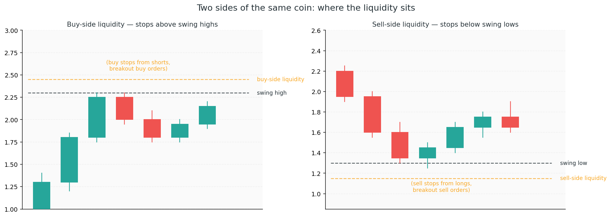
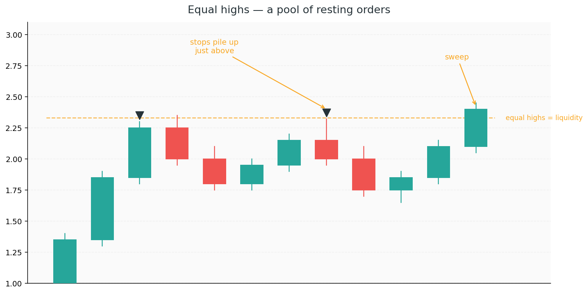
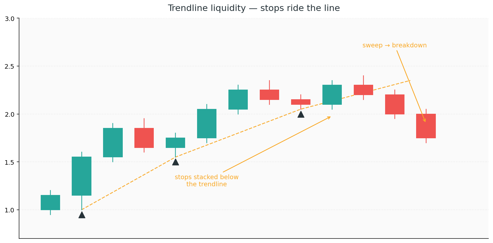

# 2. Liquidity

If Chapter 1 was about reading the *shape* of the story — the highs, the lows, the structure — Chapter 2 is about the *motive*. Why does price go where it goes? Why does it spike above a swing high just to collapse moments later? Why does a clean trendline break right when the most people have lined up behind it?

The answer is **liquidity**.

Chapter 1 hinted at this already — in the [trend section](1-market-structure.md#when-is-a-trend-actually-a-trend) we noted that a single higher high could be a *liquidity grab* rather than a real continuation, and in the [Ignoring liquidity](1-market-structure.md#ignoring-liquidity) gotcha we noted that swing highs and lows are pools of resting orders. This chapter is the full picture behind those footnotes.

The giants have a problem. They want to fill huge orders, but there aren't enough willing counter-parties sitting at the current price. If a fund wants to buy 500 million units, they need 500 million units being sold *right now*. Most of the time, that's not available. So they have to **create** it — push price to a spot where lots of people are already willing to sell, collect those sales, and only then make their real move.

That spot is wherever retail traders have placed their stops.

Every swing high has buy-stop orders just above it (from shorts, and from breakout traders waiting to buy the break). Every swing low has sell-stops just below (from longs, and from breakdown sellers). These clusters are **pools of resting orders** — sitting there, unclaimed, waiting. To the giants, they're not stops. They're **liquidity**. Free fuel to fill a large position.

Once you see the market through this lens, a lot of "random" moves stop looking random.

## Concepts

### Buy-side and sell-side liquidity

Liquidity comes in two flavours, and they sit in predictable places:

- **Buy-side liquidity** — resting buy orders *above* swing highs. When price trades up through that level, those orders get filled. The giants tap this when they want to *sell* into the buying.
- **Sell-side liquidity** — resting sell orders *below* swing lows. When price trades down through that level, those orders get filled. The giants tap this when they want to *buy* into the selling.

The names sound backwards at first: buy-side liquidity is where the giants *sell*. That's because the name refers to the orders that get *triggered*, not who the giants are. Retail stops above highs are *buy* orders (to close shorts, to chase breakouts) — and the giants use those buy orders as the other side of their sell.

### Equal highs and equal lows — liquidity magnets

When two or more swing highs print at the same level, every chart-watcher sees them. Trendline drawers, horizontal-level drawers, double-top spotters — they all pile their stops just above. The resulting liquidity pool is bigger and more concentrated than a single swing high, which makes it a **magnet**: price is more likely to come back and take it out before continuing.

Equal lows work identically, just mirrored.

A clean double top doesn't usually break into a clean reversal. Usually, it gets swept first — the third push above the level grabs the stops, then price turns. The "classic" textbook double top is frequently a trap; the *liquidity-swept* double top is the real one.

### Trendline liquidity

Retail loves trendlines. An ascending line drawn through two or three higher lows looks like a rule the market has to respect — so breakout sellers place stops just below the line, and trend traders place their longs' stops there too. That line is now a **sloping pool of liquidity**.

When price sweeps below a trendline and then reverses back up, it's not that the trendline "held." It's that the stops beneath it got collected, and the giants now have the liquidity they needed to continue the trend. The trendline break that fails is one of the most reliable liquidity patterns on the chart.

### Liquidity runs and stop hunts

A **liquidity run** (also called a *sweep* or a *stop hunt*) is the signature move: price spikes into a pool, takes it, and reverses.

The pattern has a clear shape:

1. Price approaches a swing high / low / equal-highs level
2. It breaks through with a decisive wick or a single impulsive candle
3. It immediately reverses — often within one or two candles
4. The move in the opposite direction is strong and clean

A true liquidity run almost always wicks *beyond* the level and then closes back below (for a high sweep) or above (for a low sweep). The wick is the fingerprint — it's where the stops got filled before price turned.

If price breaks the level and *stays* above (or below) with continuation candles, that's not a sweep. That's a genuine break. The difference is in the follow-through.

### Internal vs external liquidity

Not all pools are equal.

- **External liquidity** — the swing highs and lows on your *current timeframe*. The big, obvious levels.
- **Internal liquidity** — smaller pools *inside* the current range, created by minor swings between the external levels.

Price typically runs internal liquidity first (chopping through small pools inside a range), then targets external liquidity (the major high or low) before making a structural move. When you're looking for the next target, ask: *"what's the nearest untouched pool, and where's the big one beyond it?"*

### Liquidity as a target, not a signal

Here's the key shift: **liquidity is not an entry reason on its own — it's a magnet telling you where price is likely heading.**

Seeing buy-side liquidity above the current swing high doesn't mean "short now." It means "price is probably going up to grab that first, and *then* something interesting might happen." The liquidity is your *target* for the current move, and the *setup zone* for the next move after the sweep.

This flips the normal retail instinct. Retail sees a swing high and thinks "resistance — sell here." The giants see the same swing high and think "that's where I'll get my fuel — push it there, then I can turn."

## Common Gotchas

### Treating every wick as a stop hunt

Not every wick is a liquidity sweep. Wicks happen all the time — from news, from low-volume candles, from ordinary volatility. A real sweep has a specific character: it takes a *known pool* (a clear prior high, low, or equal-highs level), and it *reverses strongly*. A wick into empty space is just a wick.

### Trading the sweep too early

Seeing price approach a liquidity pool is not a signal to fade it pre-emptively. Wait for the sweep to actually happen *and* for confirmation of the reversal (a CHoCH on a lower timeframe, or a strong rejection candle). Fading before the pool is taken means you're fighting the very move the giants are trying to make.

### Assuming every pool gets taken immediately

Liquidity is a target, but not always the *next* target. Price can range sideways for hours or days before running a pool. Don't force a sweep that isn't there — note the pool as a likely future destination and wait.

### Confusing a break with a sweep

A clean break with continuation candles is a BOS — the trend is extending. A wick-and-reverse is a sweep — the move is trapping the breakout. These look similar in the first candle but are opposite in meaning. The difference shows up in the close and the follow-through:

- **BOS:** strong close past the level, next candle continues
- **Sweep:** wick past the level, close back inside, next candle reverses

If you can't tell yet, wait one more candle. The chart will tell you.

### Ignoring the higher-timeframe pool

A liquidity sweep on the 5-minute chart that runs *into* an untouched H4 pool is not a reversal — it's the setup for the H4 pool to get taken. Always look up one or two timeframes before deciding what a sweep means. The real target might still be above.

## Tying it back to structure

Chapter 1 told you *what* the giants are doing — accumulating, pushing, reversing. Chapter 2 tells you *why* price goes where it does to make those moves possible. The two layer together:

- A **BOS** that runs through a liquidity pool on the way is a stronger continuation signal — the giants fuelled up as they pushed
- A **CHoCH** that happens *right after* a liquidity sweep is a high-confidence reversal signal — the giants grabbed the fuel, then turned
- A swing high that forms without any visible pool above it is less interesting — there's no obvious reason for price to come back for it

Structure tells you the shape of the story. Liquidity tells you where the story is likely heading next. Together, they're how you read two steps ahead instead of one — and that's the edge.
