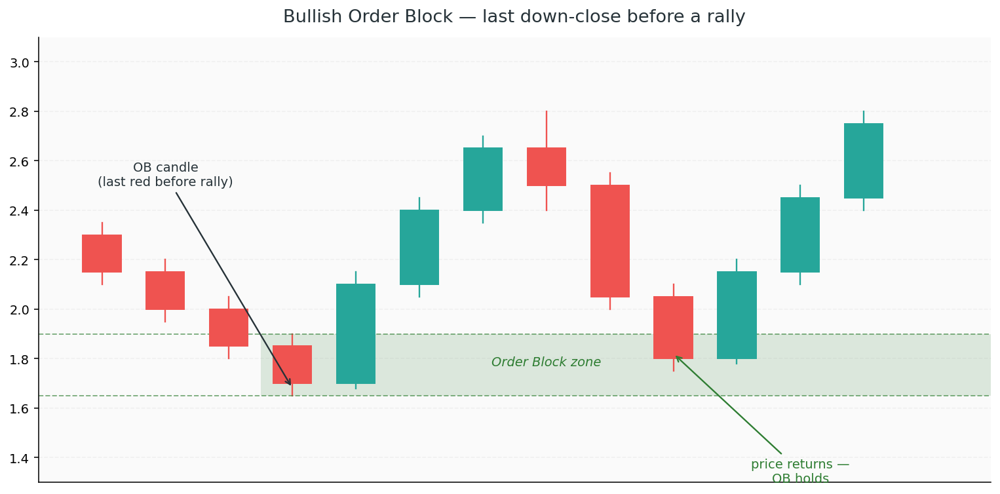

# 3. Order Blocks

If Chapter 2 explained *why* the giants need liquidity, Chapter 3 explains where they actually placed their orders. An **order block** is the footprint of institutional positioning — a specific candle (or small group of candles) where the giants loaded up before a strong move. When price later returns to that zone, their remaining orders are often still there, waiting. Those zones behave like magnets, and they're some of the highest-probability entry areas in ICT.

## Concepts

### What is an order block?

An order block is **the last opposite-colour candle before a strong move in the opposite direction.**

- **Bullish Order Block (bullish OB)** — the last *down-close* candle before a strong rally. Institutions absorbed the selling there, loaded up long, and price ripped away.
- **Bearish Order Block (bearish OB)** — the last *up-close* candle before a strong drop. Institutions distributed into the buying, loaded up short, and price collapsed.

The logic: if that candle was where the big money positioned for the move, there's a good chance they *didn't fill everything they wanted* at those prices. When price returns, they add more — and that's why the zone holds.

### How to mark an order block

1. **Find a strong, impulsive move** — displacement is the key tell (Chapter 6 covers this in detail). The more violent the move away, the more significant the OB.
2. **Locate the last candle of the opposite colour** right before the move began.
3. **Draw a zone** from the open to the close of that candle (some traders use the full high–low range, some use only the body). For now, use the **body** — open to close — as the core zone.

That rectangle is the order block. Price doesn't have to return to it, but when it does, you have a high-probability reaction zone.

### What makes an order block *valid*?

Not every last-opposite-colour candle is tradable. A good OB has:

- **Displacement** — the move away from the OB breaks structure (a BOS, ideally, or at least a strong impulsive leg)
- **An imbalance nearby** — the move left a Fair Value Gap (covered in [Chapter 4](4-fair-value-gaps.md)), which is unfinished business price is likely to come back and address
- **Liquidity taken beforehand** — the best OBs form right after a liquidity sweep (see [Chapter 2](2-liquidity.md)). The giants collected fuel, then positioned.
- **Not yet mitigated** — price hasn't returned to the OB since it formed. Once tagged, an OB is usually considered "used."

An OB that checks all four boxes is a premium setup zone. An OB that checks only one is questionable.

### Mitigation

When price returns to an OB, the giants fill any remaining orders they didn't get on the first pass. This is called **mitigation**. After mitigation:

- The OB is "used up" — its strength as a reaction zone is gone
- Price should resume in the OB's direction (bullish OB → resumes up)

If price blows clean through a mitigated OB, something bigger is going on — the structure has changed, and you should reassess the story.

### Breaker blocks

A **breaker block** is an order block that *failed* and became resistance (or support) in the opposite direction.

Example:
1. A bullish OB forms; price rallies
2. Price eventually returns and blows clean through the OB (no bounce)
3. Later, price rallies back up to that same zone — and now it acts as *resistance*

The failed OB has "broken" and flipped polarity. Breakers are a structural reversal confluence — they tell you the side that owned that zone has given up and the other side has taken over.

### Why OBs work — the institutional logic

Think of it this way: a fund wanted to buy 500 million units. They filled 400 million at the OB price, but before they could finish, the market started running away from them. They now have an unfilled 100-million order sitting at that price level. When price drifts back down to the OB, their resting buy orders get hit — and that buying pressure creates the bounce retail sees as "the OB holding."

OBs aren't magic levels. They're just **where unfinished institutional business is parked.**

## How OBs fit with the structure story

OBs aren't a replacement for structure — they're entry zones *within* structure. The flow:

1. Read the **structure** — HH + HL + BOS (Chapter 1). You have bullish bias.
2. Wait for a **pullback** into the most recent bullish OB.
3. Look for **confluence** — is the OB at a discount (Chapter 5)? Did the pullback sweep any liquidity (Chapter 2)? Is there an FVG nearby (Chapter 4)?
4. Enter on confirmation — ideally a lower-timeframe CHoCH inside the OB.

The OB tells you *where*. The structure tells you *which way*. The confluence tells you *how strongly* to trust it.

### Watch out: too-zoomed-in order blocks

On a 1-minute chart, there's an OB every few candles. Most of them mean nothing. OB quality scales with timeframe — H4 and daily OBs are institutional footprints worth respecting; M1 OBs are mostly noise.

### Watch out: treating every pullback as an OB reaction

Not every touch of an OB is a bounce. The OB is a *zone of interest* — you still need confirmation before entering. Blindly longing because "price tagged the OB" is how traders catch falling knives.

### Watch out: OBs in the wrong direction

A bullish OB is only useful if your bias is bullish. Buying a bullish OB inside a confirmed bearish trend is fighting the larger story — the OB will likely fail and become a breaker on the way down.

Always respect the higher-timeframe structure first. OBs are entries, not signals.
