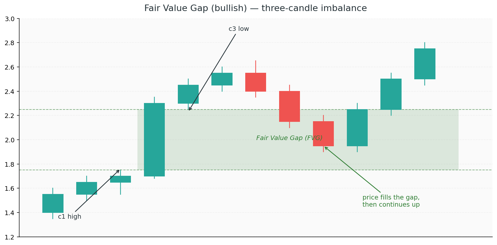

# 4. Fair Value Gaps

When the giants push price violently in one direction, they leave behind an obvious clue: a **gap in the candles** where price moved so fast that one side of the market didn't get a chance to trade. These gaps are called **Fair Value Gaps** (FVGs), or **imbalances**, and they're one of the cleanest footprints on the chart.

Price treats FVGs like unfinished business. Most of the time, it comes back to fill them — partially or fully — before continuing in the original direction. That makes them both **targets** (for the current move) and **entry zones** (for the continuation after the fill).

## Concepts

### What is a Fair Value Gap?

A Fair Value Gap is the space left by a **three-candle imbalance**:

- **Bullish FVG** — candle 2 is a strong up-candle whose body is so large that it creates a gap between **candle 1's high** and **candle 3's low**. The gap is the zone between those two wicks.
- **Bearish FVG** — mirror: candle 2 is a strong down-candle, and the gap sits between **candle 1's low** and **candle 3's high**.

The middle candle effectively "jumped" over a price zone without trading both sides. That untraded zone is the FVG.

### Why FVGs matter

Markets generally prefer **two-sided auction** — every price level gets both buyers and sellers. An FVG is a level where only *one* side traded (buyers in a bullish FVG, sellers in a bearish one). That's an **imbalance**, and imbalances tend to resolve.

Price often returns to fill the gap before continuing. That fill is the resolution — both sides have now traded at those prices, and the market can move on.

### BISI and SIBI

ICT has specific terminology:

- **BISI — Buy-side Imbalance, Sell-side Inefficiency** = a bullish FVG. Buyers dominated; sellers missed the level.
- **SIBI — Sell-side Imbalance, Buy-side Inefficiency** = a bearish FVG. Sellers dominated; buyers missed the level.

The names describe the same gap from two angles — which side had the imbalance (dominance) and which side had the inefficiency (missed trade).

### How to trade an FVG

1. **Identify the gap** after it forms — the three-candle pattern is your signal
2. **Wait for price to return** to the gap (this can take minutes, hours, or days)
3. **Look for a reaction** inside the gap — ideally an LTF CHoCH or rejection candle
4. **Enter with a stop beyond the gap** — if price closes through the far side, the FVG has failed

The best entries happen at the **edge** of the FVG (first touch) or at **50% of the gap** (the equilibrium of the imbalance itself).

### Partial fills vs full fills

Not every FVG gets fully filled. Sometimes price wicks into it and rejects; sometimes it consumes exactly half; sometimes it blasts all the way through and keeps going.

- **Partial fill + continuation** = the strongest signal. Price tapped the gap, reacted, and kept going. The institutions are still in charge.
- **Full fill + continuation** = healthy. Gap resolved, momentum continues.
- **Full fill + close through** = the gap has failed. Treat as an inverted FVG (below).

### Inverted FVG (IFVG)

When a bullish FVG gets fully closed through to the downside, it becomes an **inverted FVG** — and now it's *bearish*. Price that returns up to it should see *selling* instead of buying.

The logic is identical to the breaker block from Chapter 3: the zone has flipped polarity. What was support is now resistance.

### FVG + Order Block = high-confluence zone

When an FVG forms right next to (or overlapping) an order block, you have one of the most reliable reaction zones in ICT. Both tell you the same thing: institutions were active here, and unfinished business is parked at this level.

Stacked confluences are the whole game. An FVG alone is interesting. An FVG + OB + discount level + liquidity sweep? That's where the edge compounds.

### Watch out: tiny FVGs are noise

On any chart, there are dozens of microscopic FVGs. Most are meaningless artefacts of normal price action. A tradable FVG has:

- **Size** — the gap is at least a handful of pips / ticks wide, relative to the timeframe
- **Context** — it formed during a displacement move, not in a chop
- **Direction alignment** — it points in the same direction as your bias

### Watch out: not every FVG gets filled

FVGs are probabilistic, not guaranteed. In a very strong trend, price can leave multiple unfilled gaps behind and never return. Don't wait forever for a fill that may never come — use FVGs as *additional confluence*, not *required triggers*.

### Watch out: FVGs on the wrong timeframe

Like order blocks, FVGs scale with timeframe. A 1-minute FVG might fill in 30 seconds and mean nothing. An H4 or daily FVG can remain as a magnet for weeks. Match the FVG's timeframe to the scale of the move you're trading.
