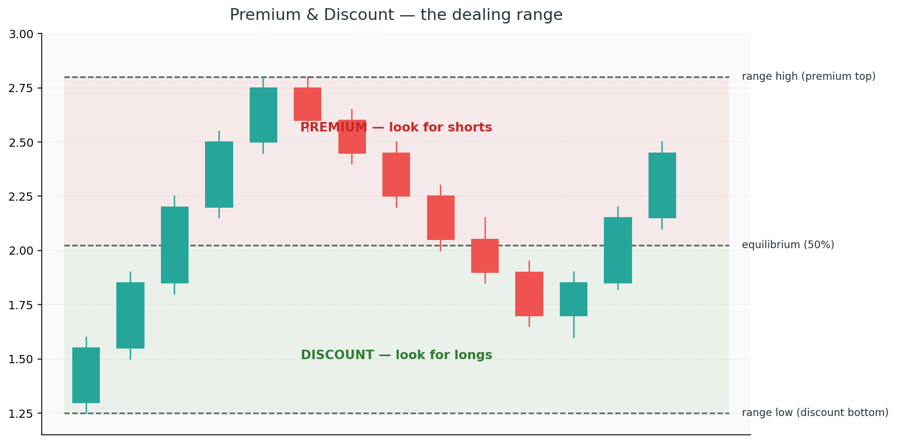

# 5. Premium and Discount

You wouldn't buy a car at the highest price on the lot. You wouldn't sell your house at the lowest offer you received. The giants follow the same basic principle — they want to **buy at a discount and sell at a premium**. The challenge is defining where discount and premium actually are.

ICT's answer: measure the current **dealing range**, split it in half, and the upper half is premium (sell zone), the lower half is discount (buy zone). Simple geometry, backed by institutional logic.

## Concepts

### The dealing range

A **dealing range** is the distance between a meaningful swing low and a meaningful swing high. It can be the last significant impulse leg, the current session's range, the week's range, or the higher-timeframe swing — pick the one that matches your trading timeframe.

The range has three key levels:

- **Range high** — top (100%)
- **Range low** — bottom (0%)
- **Equilibrium** — exactly 50% between them

Everything above equilibrium is **premium**. Everything below is **discount**.

### Why equilibrium matters

At exactly 50% of the range, price is "fair" — neither cheap nor expensive relative to the current story. The giants use equilibrium as a decision line:

- **In a bullish trend**, they want to buy *below* equilibrium (discount). Retracements that stall above 50% are suspicious — they haven't given a good price yet.
- **In a bearish trend**, they want to sell *above* equilibrium (premium). Retracements that stall below 50% are weak shorts.

This is why the OTE zone (Chapter 8) lives in the 62%–79% retracement band — it's deep in discount (or premium), exactly where the giants prefer to fill.

### Premium and Discount are *direction-aware*

A critical point: premium and discount are relative to **what the giants are doing.**

- If they're **accumulating long**, they want to buy in discount (lower half) → that's where your longs go
- If they're **distributing short**, they want to sell in premium (upper half) → that's where your shorts go

In other words: take longs only when price is in the **discount half** of the dealing range, and shorts only when price is in the **premium half**. Doing the opposite means entering at a bad price — exactly where the giants are offloading onto you.

### Choosing the right range

The dealing range you use should match your trade timeframe:

| Trading timeframe | Dealing range to measure |
|---|---|
| Scalps (M1-M5) | Last H1 or M15 impulse |
| Intraday (M15-H1) | Today's session range, or last H4 swing |
| Swing (H4-D1) | Weekly or recent daily swing |
| Position | Monthly or quarterly range |

A common mistake is measuring a range that's too big (using a yearly swing for an intraday trade) or too small (using a 5-minute swing for a swing trade). Match the tool to the job.

### Premium / discount + structure + OB = high-confluence entry

Structure tells you *direction*. Premium/discount tells you *price quality*. Order blocks and FVGs tell you *exactly where*. Stack them:

- **Bullish bias** (HH + HL + BOS)
- **Price pulls back into discount** (below 50% of the range)
- **Pullback lands on a bullish OB or FVG**
- **LTF confirmation** (CHoCH, rejection, sweep)

That's a textbook high-probability entry. Each layer adds edge.

### Re-drawing the range

Dealing ranges aren't static. Every time price breaks out of the current range (makes a new HH or LL), you need to **re-draw** to the new extremes. The old range's levels still matter for context, but your new premium/discount zones shift.

A good habit: after every new swing high or swing low, ask yourself "is this still the right range to measure?"

### Watch out: trading premium in a bearish trend (or vice versa)

Retail loves "buying support" near range lows regardless of trend. But range-low support in a *bearish* trend is often where the giants grab sell-side liquidity before the next leg down. Always check trend first, then look for premium/discount *in that direction.*

### Watch out: buying equilibrium

Exactly at 50%, you have no edge. It's neither premium nor discount. Good entries are *deep* in discount (or premium) — the 62%-79% band. If price only pulls back to equilibrium and launches, that's often a sign the move is too strong to enter on retrace — let it go.

### Watch out: the range is stale

If a range has been in place for days and price is now running out of it, the old 50% level may no longer matter. Re-draw. A stale range gives stale signals.
