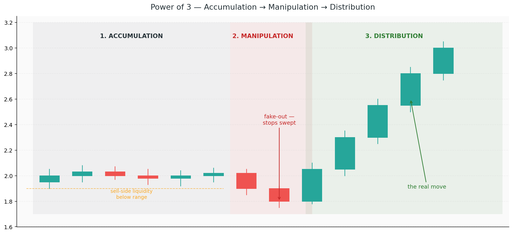

# 6. Displacement and the Power of 3

Chapter 1 covered the shape of the story. Chapter 2 covered the fuel. Chapters 3–5 covered the zones. This chapter covers the **rhythm** — how a single session, day, or week unfolds in three predictable phases, and what a "real" move looks like when the giants finally commit.

If you learn nothing else from this chapter, learn the Power of 3. It's the single most useful framework ICT offers for understanding *when* a move is about to happen, not just where.

## Concepts

### Displacement

**Displacement** is a strong, impulsive move with conviction. It's what separates a real push from a drift.

Signatures of a displacement move:
- **Large-bodied candles** — the body is 70%+ of the candle's range
- **Minimal pullback** — each candle opens near the prior close and closes at the far end
- **Gaps / FVGs** — the move is fast enough to leave imbalances behind
- **Break of structure** — price takes out prior swing highs or lows decisively

Displacement is the giants saying *"we're actually doing something now."* Most of the chart is noise — consolidation, minor swings, liquidity grabs. Displacement is the rare moment of real intent.

When you see displacement, **trust the direction**. The next pullback is usually a buying (or selling) opportunity, not a reversal.

### Why displacement matters for entries

Order blocks and FVGs are only significant if they come *from* a displacement move. A "bullish OB" in the middle of a sideways grind means almost nothing. The same OB at the base of a violent breakout is a high-probability reaction zone.

The rule of thumb: **no displacement, no tradable footprint.** If the move away from a zone was weak, don't expect the zone to hold.

### The Power of 3 — AMD

Most daily (and session-level) price action follows a three-phase pattern that ICT calls the **Power of 3** (PO3). The phases are:

1. **Accumulation** — a tight, boring range. Institutions build position. Retail gets frustrated and calls it "chop."
2. **Manipulation** — a fake move *against* the intended direction. Liquidity above/below the range gets swept. Retail piles in the wrong way.
3. **Distribution** — the real move, in the opposite direction of the manipulation. The displacement leg.

### Reading the PO3

On a typical bullish day:
1. Price opens and ranges quietly for an hour or two (accumulation)
2. Price dips *below* the morning low, sweeping sell-side liquidity (manipulation — fake breakdown)
3. Price reverses hard and rallies the rest of the session (distribution — the real move)

The bearish version: accumulation → spike up to sweep buy-side liquidity → sell-off for the rest of the day.

The manipulation leg is the critical clue. If you see price make a clean impulsive move and you're wondering whether to chase — check: did it just sweep liquidity before the move? If yes, that's likely the manipulation, and the next leg is the real one.

### PO3 on the daily candle

Zoom out: most daily candles themselves are PO3 in miniature.

- **Open** sits inside the day's range
- Price ranges through Asia (accumulation)
- London sweeps a liquidity level (manipulation)
- NY produces the main directional move (distribution)

The **closing direction of the daily candle** tells you which side won. A daily candle that closes near its high, with a wick to the low side, is a classic bullish PO3 day. The wick is the manipulation; the body is the distribution.

### PO3 and Killzones

The manipulation and distribution phases don't happen at random times — they cluster in specific **session windows** (covered in detail in [Chapter 7](7-killzones-sessions.md)):

- **Asian session** — usually accumulation
- **London session** — usually manipulation (the judas swing) and early distribution
- **New York session** — usually distribution (the main move)

This is why session timing matters so much in ICT. The same setup at different times of day has wildly different probabilities.

### Judas swing

A **judas swing** is the manipulation leg specifically. Named because it "betrays" the true direction — it moves against where the day is actually going, traps retail, and then reverses.

Classic judas swing: price dips to the prior session low in the first hour of London, stops get hit, and then price rips higher for the rest of the day. The wick on the daily candle is the judas.

### Watch out: expecting PO3 to run on your schedule

PO3 is a pattern, not a guarantee. Some days the accumulation lasts 30 minutes; some days it lasts 4 hours. Some days manipulation happens at the open; some days it happens mid-session. Don't force the pattern — wait for the liquidity sweep to actually happen before assuming manipulation is complete.

### Watch out: mistaking manipulation for a real move

This is the trap the judas swing is designed for. A sharp move below the overnight low looks like a breakdown — but if it's mid-London and there's been no displacement yet today, it's much more likely the manipulation.

Signs you're looking at manipulation, not distribution:
- The move swept an obvious liquidity pool (sweep, not break)
- It happened at a session-change window
- The move is shallow and lacks displacement
- Momentum dies almost immediately

### Watch out: there's no distribution without accumulation

A displacement move that appears out of nowhere (no prior accumulation phase) is often news-driven or exhaustion — not institutional positioning. The giants always build before they push. If you can't see where they built, be cautious about trusting the move.
