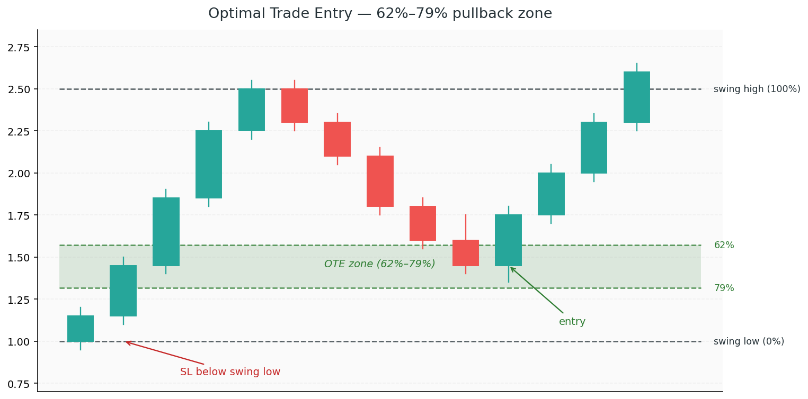

# 8. Optimal Trade Entry

By now you have most of the pieces: structure, liquidity, order blocks, FVGs, premium/discount, displacement, and timing. The **Optimal Trade Entry** (OTE) is where they come together into a specific, mechanical entry model.

OTE isn't a separate concept so much as an **entry refinement** — a way to narrow down *exactly* where inside a pullback you want to pull the trigger. It's deep discount (or premium), stacked with confluence, triggered with confirmation.

## Concepts

### The OTE zone

The OTE is the **62%–79% Fibonacci retracement** of a completed impulse leg. This band sits deep in discount (for a long) or deep in premium (for a short).

Why this specific band?
- Retracements that hold *above* 62% (i.e., in the 38%–61% zone) haven't given a "good price" yet. The giants wouldn't fill here.
- Retracements *below* 79% are encroaching on the swing extreme — the move is at risk of failing entirely.
- The 62%–79% band is the sweet spot: deep enough to be real discount/premium, shallow enough that the original impulse is still intact.

### How to measure the OTE

1. **Identify a completed impulse leg** — a recent swing low to swing high (for a long setup) or swing high to swing low (for a short)
2. **Draw a Fibonacci retracement** from the leg's start (0%) to its end (100%)
3. **Mark 62% and 79%** — the zone between them is your OTE

In ICT, the **70.5% level** (golden pocket, halfway between 62% and 79%) is often highlighted as the ideal entry inside the OTE band.

### OTE + confluence stack

OTE alone is a probability boost. OTE *with confluence* is where the edge compounds. Ideal stack:

1. **Higher-timeframe bias** — HH + HL + BOS (Chapter 1) in your intended direction
2. **Price pulls back into the OTE zone** (62%–79%)
3. **Inside the OTE**, you have a bullish order block (Chapter 3) or FVG (Chapter 4)
4. **The pullback swept liquidity** on its way down (Chapter 2)
5. **Session timing** aligns — e.g., the setup is forming during the NY AM killzone (Chapter 7)
6. **LTF confirmation** fires inside the OTE — a clean CHoCH on M1 or M5 confirms the reversal

When all of these align, you have a textbook high-probability setup. Missing one or two is fine; missing four of them means you're trading on hope.

### Trade construction

Once you've identified an OTE setup:

- **Entry** — inside the OTE zone, ideally on LTF confirmation (CHoCH or displacement back in trend direction)
- **Stop loss** — below the swing low that created the impulse leg (for a long) or above the swing high (for a short). A few pips beyond, never exactly at, to avoid the wick sweep.
- **Take profit** — at the next significant liquidity pool or structural level in the trade direction. Minimum 2R, ideally 3R+.

### Partial targets vs full runners

Two approaches to managing OTE trades:

- **Partials** — scale out at 1R, 2R, 3R. Reduces win-rate pressure; locks in profit.
- **Runners** — full size to the target. Higher variance, higher reward when it works.

Most ICT traders take partials at 1R (moving to break-even), then let the rest run to the full liquidity target. This is a reasonable default.

### OTE in bearish setups

Everything mirrors for shorts:
- Measure the impulse *down* leg (swing high to swing low)
- OTE is still 62%–79% retracement — but now it's measured *up* from the low
- Look for bearish OBs, SIBI FVGs, premium levels inside the zone
- Short on LTF CHoCH inside the OTE

### When *not* to take an OTE

OTE is a pullback entry. It assumes the trend continues. Don't take an OTE when:

- The larger structure has just printed a CHoCH (trend is in question)
- Price didn't leave displacement on the impulse leg (weak move, weak pullback reaction)
- The pullback is too deep (beyond 79%) or too shallow (above 62%) — just wait for the next opportunity
- You're inside a known consolidation range — OTEs need a clear directional leg to measure from

### Watch out: forcing the OTE on a bad impulse

Not every leg up is a tradable impulse. If the move lacked conviction (small-bodied candles, no BOS, no displacement), the OTE on that leg is low-quality. Match your entries to the *quality* of the leg you're retracing, not just the fact that a leg exists.

### Watch out: missing the OTE by waiting for LTF perfection

Sometimes price hits the OTE and reverses without waiting for your perfect M1 CHoCH. If the HTF setup is solid and price is at the golden pocket with a clear OB, a limit entry is often better than waiting for LTF confirmation and missing the move.

Know when to use a limit (deep confluence, HTF conviction) vs. confirmation (when the setup is softer).

### Watch out: OTE outside your timeframe

An H4 OTE is a swing trade. An M5 OTE is an intraday trade. Don't mix timeframes — if you're entering on an M5 OTE but measuring structure on H4, your stop and target don't line up with what you're actually trading. Pick one scale and stick to it.
